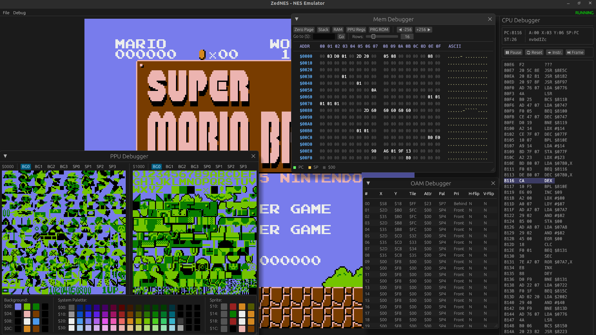

# ZedNES

A Nintendo Entertainment System (NES) emulator written in Rust, featuring a graphical interface with built-in debugging tools.



## Features

- **MOS 6502 CPU** emulation with full official instruction set support
- **PPU** (Picture Processing Unit) producing 256×240 output
- **NTSC / PAL** timing (configurable TV system)
- **iNES ROM format** parsing with mappers support
- **Controller input** (Player 1 & 2)
- **Built-in debuggers** (CPU, RAM, PPU, APU)

## Requirements

- [Rust](https://www.rust-lang.org/tools/install) (edition 2024 / stable toolchain)

## Building

```bash
git clone https://github.com/your-username/zednes.git
cd zednes
cargo build --release
```

The compiled binary will be at `target/release/zednes`.

## Running

```bash
cargo run --release
```

To start directly with a ROM:

```bash
cargo run --release -- "roms/Super Mario Bros. (World).nes"
```

Use **File → Load ROM…** in the menu bar to load a `.nes` ROM file.

## Controls

> Default keyboard mapping (configurable only in source for now):

| NES Button | Key  |
|------------|------|
| A          | K    |
| B          | L    |
| Start      | E    |
| Select     | Q    |
| D-Pad      | WASD |

| Debugger     | Key   |
|--------------|-------|
| Resume/Pause | Space |
| Reset        | R     |
| Step Instr.  | T     |
| Step Frame   | Y     |

## Debuggers

Open any debugger from the **Debug** menu:

- **CPU Debugger** - shows registers (A, X, Y, SP, PC), status flags, and a disassembly view.
- **Palette Debugger** - renders both pattern tables and the system palette.
- **Mem Debugger** - hex dump of the full address space with a *Go to address* input.
- **OAM Debugger** - shows the values of the entries in OAM.
- **Audio Diagnostics** - Shows buffer fill, volume, underflows, overflows, and target FPS

## Project Structure

```
src/
├── main.rs              # Entry point
├── lib.rs               # Library root
├── app/
│   ├── state.rs         # Emulator lifecycle (load, reset, pause, step)
│   └── ui.rs            # egui application & all UI panels
├── emulator/
│   ├── nes.rs           # Top-level NES struct (ties CPU + Bus together)
│   ├── bus.rs           # Memory bus (CPU RAM, PPU registers, cartridge)
│   ├── cpu/             # MOS 6502 CPU implementation
│   ├── ppu/             # PPU & TV system timing
│   └── cartridge/       # iNES parser & mapper implementations
├── input/
│   └── controller.rs    # NES controller button state
└── renderer/
    └── frame_buffer.rs  # Middle ground between PPU and egui
```

## ROM Compatibility

| Mapper | Name   | Status       |
|--------|--------|--------------|
| 000    | NROM   | ✅ Supported |
| 002    | UNROM  | ✅ Supported |
| Others | -      | 🚧 Not yet implemented |

## Dependencies

| Crate    | Purpose |
|----------|---------|
| `eframe` | Native window & egui rendering |
| `rfd`    | File browser |

## License

This project is licensed under the MIT License. See [LICENSE](LICENSE) for details.
